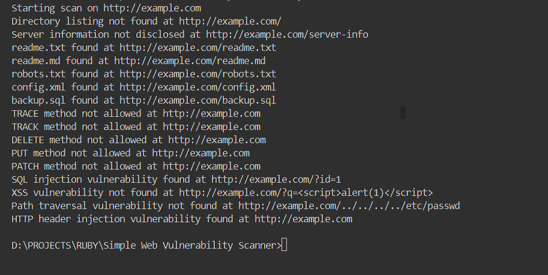

# Simple Web Vulnerability Scanner

  

## 📖 Overview

The **Simple Web Vulnerability Scanner** is a lightweight tool designed to identify common vulnerabilities in web applications. This project aims to help developers and security enthusiasts to secure their web applications by detecting potential security issues.

## 🚀 Features

- **Cross-Site Scripting (XSS) Detection**: Identifies potential XSS vulnerabilities.
- **SQL Injection Detection**: Scans for SQL injection points.
- **Directory Traversal Detection**: Checks for directory traversal vulnerabilities.
- **Customizable Scans**: Allows users to define custom scan rules.
- **Detailed Reports**: Generates comprehensive reports of the scan results.

## 🛠️ Installation

To install and run the Simple Web Vulnerability Scanner, follow these steps:

1. **Clone the repository**:
   ```bash
   git clone https://github.com/yourusername/simple-web-vulnerability-scanner.git
   ```
2. **Navigate to the project directory**:
   ```bash
   cd simple-web-vulnerability-scanner
   ```
3. **Install dependencies**:
   ```bash
   bundle install
   ```

## 📈 Usage

To start a scan, run the following command:

```bash
ruby scanner.rb -u http://example.com
```

You can also specify additional options:

```bash
ruby scanner.rb -u http://example.com -o output.html
```

## 📷 Screenshots



## 🔧 Further Improvements

- Add support for more vulnerability types.
- Implement a web-based user interface.
- Enhance the reporting system with more detailed analytics.
- Integrate with CI/CD pipelines for automated security testing.

## 🤝 Contributing

Contributions are welcome! Please fork the repository and submit a pull request.

## 📜 License

This project is licensed under the MIT License. See the [LICENSE](LICENSE) file for details.

Made with ❤️ by Kunj Shah
